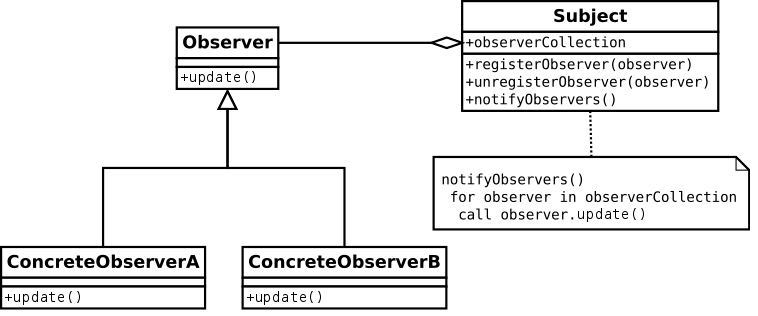

# Team Stone Wiki 3 - Programming Languages Deep Dive C#

C# is an advanced, flexible, and influential programming language engineered by Microsoft. As an integral component of the .NET framework, it delivers a sturdy foundation for creating diverse applications across web, desktop, mobile, and gaming platforms. Within this Wiki, we will delve into several crucial topics that enrich your comprehension of C# and its vast capabilities.

## Data Types

In programming languages, a data type defines a collection of data values and a set of predefined operations on the values. C# is a strongly typed language, meaning every variable and constant must declare the type of data it will store. This is also true when defining methods, where every method declaration specifies a data type for each input parameter and for the return value. In C# data types are predefined (as part of the language) and can be either explicitly specified (using the appropriate keyword) or implicitly specified (using the var keyword to let the compiler infer the type). The compiler uses this data type information to make sure all operations that are performed are type safe. 

In C# the information stored in a data type includes the storage space that a variable of the type requires, and the maximum and minimum values that a variable of the type can represent. Additionally, the information in a data type can also include the base type it inherits from, the interface it implements, and the kinds of operations that are permitted.

C# data types are (mainly) categorized as either value types or reference types. Value types include simple types, enum types, struct types, and nullable types. Reference types on the other hand include class types, interface types, array types, and delegate types. See the chart below for reference [1]. 


In C# the most common data types are the int, long, float, double, bool, char, and string. The following chart defines the size limitations and describes the use case for each of these types.


The first four types in the list are referred to as number types. The int and long types are collectively known as the integer types because they store whole numbers, and which type to use depends on the size of the numeric value. The float and decimal types are collectively known as the floating-point types because they store numbers with a fractional part, and (like with integers) which type to use depends on the size of the numeric value. The bool type (short for Boolean) is a binary variable meaning it has only two possible values, used to represent true and false values. The char data type is used to store a single alpha-numeric character. And last, the string type is used to store a block of text comprised of a sequence of characters. 

## Expressions

In programming languages, expressions are the fundamental means of specifying computations. In C# there are two (main) types of expressions, arithmetic (that evaluate to a number), and relational (that evaluate to a Boolean). In general, an expression is a sequence of operators and operands that evaluate to a single value (called the result of an expression). In C# arithmetic operators include addition, subtraction, multiplication, division, modulus, increment, and decrement (and will evaluate to a number value). The relational operators include equal to, not equal to, greater than, less than, greater than or equal to, and less than or equal to (and will evaluate to a Boolean value). You can also combine relational expressions with the logical operators AND, OR, and NOT.

In C# the operands can be variables, literals, or method calls (that return a value), and the resulting value from the expression must have a data type associated with it. To be precise, in C#, an expression must have at least one operand but may not have any operators. Like in many programming languages, C# evaluates an expression by using the precedence of the operators. The following charts define these operators (mentioned above) and gives examples about how to use them with operands in an expression [2].

Arithmetic operators:


Relational operators:


Logical operators:


## Assignment Statements
In C#, assignment statements play a fundamental role in programming as they allow you to assign values to variables and modify their contents. An assignment statement typically consists of an expression on the right-hand side (RHS) and a variable or a memory location on the left-hand side (LHS), separated by the assignment operator (=).

The assignment operator (=) in C# is used to assign a value to a variable. The value on the right-hand side of the assignment operator is evaluated and then stored in the variable on the left-hand side [3]. For example:

int x = 10;

In the above example, the integer variable x is assigned the value 10. The assignment statement sets the value of x to 10, allowing you to later use the variable in computations or for other purposes.

C# supports various types of assignment statements: simple assignment, compound assignment, multiple assignment, and increment and decrement. Simple assignmentis the most basic form of assignment involves assigning a value directly to a variable, as shown in the previous example. In compound assignment, C# provides operators that combine an arithmetic operation with the assignment operation. These operators perform the arithmetic operation and then assign the result to the variable [3]. For example:

int x = 5;
x += 3;  // Equivalent to x = x + 3
In this case, the value of x is incremented by 3 using the compound assignment operator +=.

In multiple assignment, C# allows you to assign values to multiple variables in a single assignment statement. This can be done using comma-separated expressions on the right-hand side. For example:

int a, b, c;
a = b = c = 10;  // Assigns the value 10 to all variables
In this case, the value 10 is assigned to variables c, b, and a in a cascading manner.

Finally, C# provides increment (++) and decrement (--) operators, which are often used for modifying the value of a variable by one. These operators can be used both as prefix and postfix. For example:

int count = 0;
count++;  // Increment count by 1
In this example, the value of the variable count is incremented by 1.

Assignment statements are essential in programming, allowing you to store values in variables, update them, and manipulate data throughout the execution of a program. They form the backbone of data manipulation and play a crucial role in controlling the flow and behavior of programs written in C#.

## Statement-Level Control Structures
In many scenarios someone writing code will want some way to repeat the same block over and over because what they have written may need to occur multiple times. For example, suppose we want to search a Microsoft excel document that is thousands of rows tall and hundreds of columns wide for a value we know is there but are uncertain where. Writing individual expressions to search the document cell by cell would probably take longer than simply manually searching the document ourselves and the code file's size we write may also exceed the document it's programmed to search. With each cell along the way we would want to evaluate the data and determine if it's the value we are looking for or not. In computer programming languages such repetitious behavior and decision making branches are refered to as control statements. The collection and organization of control statements is called a control structure[5].

C# offers traditional selection, multiple selection, interative and unconditional branching control statements and oftentimes updated for readability compared to their counterparts in other languages. In this section we will explain some of the more commonly used structures and demonstrate them with examples.

### Selection:
A selection control statement allows code to branch multiple ways depending upon the evaluation of data. C# offers the if-then-else-end selection statement found in many other languages but the then and end reserved words are removed. Take this code sample for example;

    if (shouldContinue == true){
	    DoSomething();
    }
    else{
	    //A different block of code...
    }

in this example whenever the code reaches the if statement the boolean expression  ```shouldContinue == true``` is evaluated. If the value of ```shouldContiue == true``` is true then the DoSomething function within the curley braces following the checked condition is called. If ```shouldContinue == true``` evaluted to false then code within the curley braces following the else reserve word is executed instead.

### Multiple-Selection
In C# multiple-selection can be done with switch statements and if-elseif-else. Unlike other C based languages that feature switch selection, C# enforces a ```break``` or ```goto``` statement within each case[6]. 


	switch (color)
        {
            case "red":
		        Console.WriteLine("Color is red");
            case "green":
                Console.WriteLine("Color is green");
                break;
            case "blue":
                Console.WriteLine("Color is blue");
		        break;
            default:
                Console.WriteLine("not a valid color");
                break;
        }

In this example the compiler will produce an error because the ```"red"``` case does not break or goto one of the other cases. This also applies to the default case. 

C#'s switch statement supports all numerical types(including ```enum``` and ```char```), strings and boolean values. C# also includes something known as a 'Case guard'. By using the ```when``` keyword you can allow a boolean expression check before the case's value is checked. 

	string color = "red";
        bool safe = false;
        switch (color)
        {
            case "red" when (safe == true):
                Console.WriteLine("Color is red");
                break;
            case "green":
                Console.WriteLine("Color is green");
                break;
            case "blue":
                Console.WriteLine("Color is blue");
                break;
            default:
                Console.WriteLine("not a valid color");
                break;
        }

In this example the ```"red"``` case would not be accepted and the switch would evalutate to the default because the guard statement ```(safe == true)``` would not evaluate to true. A similar effect could be achieved in other languages without safe guards by simply adding an ```if``` statement before the contents the case block. This approach reduces the number of lines necessary and prevents the need for the additional nesting in the control statement. Although, C# does support nesting your selection statements as deeply as you would like.

### Iterative Statements
C# like many other languages supports iterative statements, which are usually refered to as loops. The purpose of the loop is to execute the same block of code numerous times while also determining if the looping behavior needs to continue(In many cases this also includes keeping track of how many times the loop has iterated). C#'s for loop syntax is practically identical to other C style languages. Take the most classical loop structures for example; the ```for-loop```

    int[] intArray = {1,2,3,4,5,6,7,8,9,10};
    for(int i = 0; i < 10; i++){
	    Console.WriteLine(intArray[i]);
    }

In this example the semicolon separated expressions within the parenthesis are known as loop parameters. The first one being the loop variable or "initializer" where the iterative steps/progress value is stored. The second is the terminal or "for condition", which determines if the loop continues and is evaluated once before each iteration in the loop including the first. And lastly is the iterator, which updates the value of the loop variable after each loop iteration[7]. It is important to note that for loops typically use numerical values but C# supports non numerical values and function calls for the loop parameters should you desire;

	    int number = 13;
        for(bool isEven = false; isEven == false; isEven = isNumEven(number))
        {
            Console.WriteLine("looping to hit even number");
            number++;
        }

In this example our initializer is a boolean variable and the iterator is an assignment an a call to a seperate function that may have any amount of code that will be executed at the end of each iteration.

### Unconditional Branching
In control structures unconditional branching statements refers to statements that direcct code execution to specific locations without the conditional checks you would find in an ```if``` or ```switch``` statement. Though this feature can be very useful it's often regarded as dangerous since it can make programs hard to read[5]. C# offers this feature but has scope limitations that prevent the code path from breaking out of the scope the branch was encountered. Here is a valid usage of C#

	loopRestart: // goto leads back here
    for(int i = 0; i < 10; i++)
    {
        Console.WriteLine(i);
        for (int j = 0; j < 10; j++)
        {
            goto loopRestart;
        }        
    }
    
In this example the looping structure repeats infinitely. Once the inner loop begins it encounters the goto statement, which causes the code path to leave both loops and where it resumes execution at the loopRestart: statement just before the first loop.

If we attempt to put the loopRestart: statement someplace else in the code that is out of the goto statement's scope it will result in a compiler error. This is an example that will generate the error:

	for(int i = 0; i < 10; i++)
        {
            Console.WriteLine(i);
            for (int j = 0; j < 10; j++)
            {
                goto loopRestart;
            }        
        }

    for(int i = 0;i < 10; i++)
    {
        loopRestart: //cannot reach this branch via the goto statement
        Console.WriteLine(i);
    }

## Subprograms
Subprograms are also known as functions or methods. They play a crucial role in C# programming by encapsulating a set of instructions into a reusable block of code sometimes also thought of as a protocal. A subprogram in C# is defined within a class and can be called and executed multiple times from different parts of the program. This concept follows the fundamental principle of modularity, which allows developers to break down complex tasks into smaller, manageable units of code.
Breaking down the problem in this way then allows for those units of code to be reused for other instructions.

In C#, subprograms do not have a key word that is used to delare them. Instead it is done by
declaring the visability of the method using public, private or protected followed by the return type, name, and a set of parentheses that may sometimes contain parameters. 
The body of the subprogram contains the instructions code to be executed when the subprogram is called. 
Parameters can be used to pass data into the subprogram, and the return type specifies the type of value that the subprogram may return to the caller.

Small Example:
```
static void <method name>(string name)
{
	Console.WriteLine("Hello World!, {0}", name);
}

static void Main(string[] args)
{
	MyMethod();
}
```
By using subprograms, developers improve code organization, maintainability, and reusability.
 Subprograms allow for code modularization, letting developers to focus on individual tasks and abstract away the complexity of the overall program.
  With the use of subprograms, code duplication is minimized, by simply calling subprograms within other subprograms.
   Finally, subprograms enhance code readability and debugging, as the logic for a particular task is encapsulated within a self-contained block, making it easier to understand and troubleshoot.

## Abstract Data Types and Encapsulation Concepts

Encapsulation in C# also allows for the creation and usage of abstract data types (ADTs). An abstract data type is a high-level representation of a data structure that encapsulates the data and the operations that can be performed on it. This is done by leveraging encapsulation, C# allows developers to define classes that serve as ADTs (arraylist, linkedlist, stacks and queues) by encapsulating the data and methods related to that data.

For example, consider a stack ADT implemented in C#. The stack class would encapsulate an underlying array or linked list and provide methods like Push, Pop, and Peek to manipulate the stack's elements. The inner workings of the class would be hidden form the end user, only ever allowing them to interact with the public methods.

Encapsulating abstract data types in C# using encapsulation makes it so that the data and the operations on that data are tightly coupled, promoting encapsulation's benefits such as data hiding, modularity, and code organization. By encapsulating the stack data structure, developers can easily reuse the stack class in different parts of their codebase without worrying about its internal implementation, promoting code reusability and maintainability, allowing for a plug and play type of feeling that saves the developer alot of time allowing them to focus on what actually matters for them.

## Object-Oriented Programming

Object-oriented programming (OOP) is a programming paradigm that organizes code around the concept of objects, which are instances of classes. Objects encapsulate data and behavior together, allowing for the creation of reusable and modular code. C# provides a rich set of features that facilitate the implementation of OOP concepts.

Classes are fundamental building blocks in C#. They serve as blueprints for creating objects and define their properties and behaviors. By defining classes, you can create multiple instances of objects with similar characteristics and behaviors. This promotes code reusability and allows for a more efficient and organized approach to programming [4].

Inheritance is another important aspect of OOP supported by C#. It allows you to create new classes based on existing ones, inheriting their attributes and behaviors. This mechanism enables code reuse and promotes the concept of hierarchy, where more specialized classes inherit properties and methods from more general ones. Inheritance facilitates the creation of more flexible and scalable applications [4].

Polymorphism is yet another key feature of object-oriented programming that is well-supported in C#. It allows objects of different classes to be treated as objects of a common base class. Polymorphism allows for more flexibility in designing and implementing systems, as it allows different objects to respond differently to the same method call. This promotes code extensibility and enhances the modularity of applications [4].

Encapsulation is an important principle of OOP that focuses on hiding the internal details of an object and exposing only necessary information through well-defined interfaces. C# provides access modifiers like public, private, protected, and internal to control the visibility and accessibility of class members. Encapsulation enhances code maintainability and reduces the impact of changes made to the internal implementation of an object [4].

C# also supports other essential OOP concepts such as abstraction and association. Abstraction allows you to represent complex systems by simplifying and focusing on essential aspects, while association enables the relationship between classes and objects to be defined.

By providing these powerful features and supporting key principles of object-oriented programming, C# enables developers to write clean, modular, and reusable code. It allows for the creation of robust and scalable applications, promotes code organization, and facilitates collaboration among teams of developers. C# has become a popular choice for software development, especially in the Microsoft ecosystem, due to its rich OOP capabilities and extensive support from the .NET framework.

## Exception Handling and Event Handling (Chapter 14) - Michael

### Exceptions
When writing programs we often rely on the IDE, testing and our general knowledge of how the language works to prevent us from introducing errors into the program. Despite our reliance we are still sometimes prone to error in ways that are outside what the program is designed to do or have control of. Take for example a program that reads a data file for processing. We could armor against software bugs by checking that the format and contents of the data file are correct but this assumes the file exists when and where we expect it. The user's folder structure and anything else that happens inside it while the program is running from memory can be unreliable. Such unusual but detectable errors are refered to as "exceptions" and the process of predicting and accounting for specific expections in the program is known as "exception handling"[5]. 

C# offers exception handling that closely resembles an ```if-elseif-else``` style control statement. Using the ```try``` keyword a user can place their code in a special block that will be monitored for exceptions. Here is an example of the syntax.

	//numberArray is an integer array of unknown length
	try{

		for(int i = 0; i < 10; i++){
			Console.WriteLine(numberArray[i]); // an exception may happen here
		}
	}

If the user is anticipating an exception, such as the missing file used in the example earlier, they can follow the ```try``` statement with a ```catch``` statement. Code within the block following the ```catch``` statement is executed if that ```catch``` statement is encountered. Here's an example building upon the previous.

	//numberArray is an integer array of unknown length
	try{

		for(int i = 0; i < 10; i++){
			Console.WriteLine(numberArray[i]); // an exception may happen here
		}
	}
	catch(System.IndexOutOfRangeException e){
		Console.WriteLine("Outside the bounds of the numberArray!");
	}

The ```catch``` statement can be general and react to any exception or its focus can be narrowed down if you are anticipating a specific exception(or even one that inherits from another). Just like the ```else-if``` statement many ```catch``` statements can follow each other if you want to handle multiple possible exceptions in unique ways. 

After the ```try``` statement a user can also follow with a ```finally``` statement. Code in the block following a ```finally``` statement is executed regardless if an exception was caught or not. It offers the user a way to 'clean up' following an error prone section of ```try``` statement code if needed[8]. In C# a ```try``` statement must be followed by a ```catch``` and/or ```finally``` statement. Failing to do so will generate a compiler error.

	catch (System.IndexOutOfRangeException e)
    {
        Console.WriteLine("Whoops! outside the array's boundaries!");
        int[] newArray = new int[11];

        foreach (int i in newArray)
        {
            newArray[i] = intArray[i];
            intArray = newArray;
        }
    }
    finally
    {
        Console.WriteLine("The size of the array is:" + intArray.Length); // will be different if exception was caught
    }
    

C#'s System library offers a wide variety of commonly generated exceptions. You can find some of the more common ones here: [9]. C# also allows you to generate your own exceptions by creating a type that inherits from ```System.SystemException``` and generating it during run time with the reserved word ```throw```

	throw new SystemException("I'm exceptional!");

### Event Handling
Event handling is similar to exception handling. It is a way to react to something unpredictable that happens during runtime but usually does not refer to erroneous behavior. An event is defined as a notification that something specific has occured[5]. An event handler is the code executed as a result of the event occuring or being "raised". Events are a staple of many GUI driven applications and available out of the box in C# through the .NET framework. C#'s event handling is closely modeled after the observer design patter. In observer design pattern one or more objects known as "observers" will subscribe to a "subject" object. When conditions are met the subject will iterate through it's list of subscribers and call a notification method on them. Using this observer-subject relationship events can be raised whenever unpredicatable but intended actions occur such as button presses on a UI or devices being plugged into the computer.  In C#'s .NET framework this is further extended through delegates, which are references to methods instead of object instances[10].




## Simple program

This program is a simple banking application that allows users to create and manage their bank accounts. Upon launching the program, users are prompted to enter their name and account number. If an existing account is found, the program displays the account details; otherwise, a new account is created. Users can then perform various banking operations such as making deposits, withdrawals, and printing their account statements. The program ensures that only valid inputs are accepted and provides helpful error messages when necessary. Overall, this application provides a user-friendly interface for managing personal bank accounts and conducting financial transactions.

The immage below is an example of how the program operates:


Program code in C#:

using System;
using System.Collections.Generic;

enum TransactionType
{
    INCOME,
    EXPENSE
}

class Transaction
{
    private DateTime dateTime;
    private decimal amount;
    private TransactionType type;
    private string comment;

    public Transaction(DateTime dateTime, decimal amount, TransactionType type, string comment)
    {
        this.amount = (type == TransactionType.INCOME) ? Math.Abs(amount) : -1 * Math.Abs(amount);
        this.dateTime = dateTime;
        this.comment = comment;
        this.type = type;
    }

    public override string ToString()
    {
        return type.ToString() + " : $" + amount.ToString() + " At " + dateTime.ToString() +
            " Comment : " + comment;
    }
}

class IllegalActivityException : Exception
{
    public IllegalActivityException(string message) : base(message)
    {
    }
}

class BankAccount
{
    private static int CLASSNUMBER = 0;
    private string Number;
    private string Owner;
    private decimal Balance;
    private List<Transaction> statementHistory;
    private Dictionary<string, int> ValidEntries;

    public BankAccount(string Owner)
    {
        CLASSNUMBER++;
        Number = CLASSNUMBER.ToString();
        this.Owner = Owner;
        Balance = 0;
        statementHistory = new List<Transaction>();

        ValidEntries = new Dictionary<string, int>();
        ValidEntries.Add("0", 0);
        ValidEntries.Add("1", 0);
        ValidEntries.Add("2", 0);
        ValidEntries.Add("3", 0);
        ValidEntries.Add("exit", 0);
        ValidEntries.Add("punch", 0);
    }

    public void MakeDeposit(decimal amount, DateTime date, string comment)
    {
        statementHistory.Add(new Transaction(date, amount, TransactionType.INCOME, comment));
        Balance += Math.Abs(amount);
    }

    public void MakeWithdrawal(decimal amount, DateTime date, string comment)
    {
        statementHistory.Add(new Transaction(date, amount, TransactionType.EXPENSE, comment));
        Balance -= Math.Abs(amount);
    }

    public Dictionary<string, int> GetValidEntries()
    {
        return ValidEntries;
    }

    public string GetOwner()
    {
        return Owner;
    }

    public decimal GetBalance()
    {
        return Balance;
    }

    public List<Transaction> GetStatementHistory()
    {
        return statementHistory;
    }

    public string PrintStatement()
    {
        string str = "Account Statement:\n";
        foreach (var item in statementHistory)
        {
            str += "\t" + item.ToString() + "\n";
        }
        str += "End Statement\n";
        return str;
    }

    public override string ToString()
    {
        string str = "";
        str += "Account Number : " + Number.ToString() + "\n";
        str += "Account Holder : " + Owner.ToString() + "\n";
        str += "Account Balance : " + Balance.ToString() + "\n";
        return str;
    }
}

class Program
{
    static string userInput = "";

    public static void Main(string[] args)
    {
        List<BankAccount> bankAccounts = new List<BankAccount>();
        bankAccounts.Add(new BankAccount("Stone"));

        bool isUser = false;

        Console.WriteLine("Welcome to Team Stone Bank\n");
        Console.WriteLine("We are glad to have you as a client");
        Console.WriteLine("Enter \"exit\" anytime to end the program");

        int currentAccountIndex = -1;

        while (!userInput.Equals("exit"))
        {
            switch (isUser)
            {
                case false:
                    currentAccountIndex = MainMenu(bankAccounts);
                    isUser = true;
                    break;

                case true:
                    Console.WriteLine("\n\n");
                    Console.WriteLine("Enter 0 to make a deposit");
                    Console.WriteLine("Enter 1 to make a withdrawal");
                    Console.WriteLine("Enter 2 to print account statement");
                    Console.WriteLine("Enter 3 to go back to the main menu");

                    userInput = Console.ReadLine();

                    if (!bankAccounts[currentAccountIndex].GetValidEntries().ContainsKey(userInput))
                    {
                        Console.WriteLine("Invalid Entry");
                        continue;
                    }

                    switch (userInput)
                    {
                        case "0":
                            Console.WriteLine("Enter deposit amount:");
                            decimal depositAmount = Convert.ToDecimal(Console.ReadLine());
                            Console.WriteLine("Enter deposit date (MM/dd/yyyy):");
                            DateTime depositDate = DateTime.ParseExact(Console.ReadLine(), "MM/dd/yyyy", null);
                            Console.WriteLine("Enter deposit comment:");
                            string depositComment = Console.ReadLine();
                            bankAccounts[currentAccountIndex].MakeDeposit(depositAmount, depositDate, depositComment);
                            Console.WriteLine("Deposit successful!");
                            break;

                        case "1":
                            Console.WriteLine("Enter withdrawal amount:");
                            decimal withdrawalAmount = Convert.ToDecimal(Console.ReadLine());
                            Console.WriteLine("Enter withdrawal date (MM/dd/yyyy):");
                            DateTime withdrawalDate = DateTime.ParseExact(Console.ReadLine(), "MM/dd/yyyy", null);
                            Console.WriteLine("Enter withdrawal comment:");
                            string withdrawalComment = Console.ReadLine();
                            bankAccounts[currentAccountIndex].MakeWithdrawal(withdrawalAmount, withdrawalDate, withdrawalComment);
                            Console.WriteLine("Withdrawal successful!");
                            break;

                        case "2":
                            Console.WriteLine(bankAccounts[currentAccountIndex].PrintStatement());
                            break;

                        case "3":
                            isUser = false;
                            break;

                        default:
                            Console.WriteLine("Invalid Entry");
                            break;
                    }

                    break;

                default:
                    break;
            }
        }
    }

    public static int MainMenu(List<BankAccount> bankAccounts)
    {
        Console.WriteLine("\n\n");
        Console.WriteLine("Enter your name:");
        string name = Console.ReadLine();

        BankAccount account = bankAccounts.Find(a => a.GetOwner() == name);

        if (account != null)
        {
            Console.WriteLine("\nWelcome back, " + name + "!");
            Console.WriteLine(account.ToString());
        }
        else
        {
            Console.WriteLine("\nHello, " + name + "! We couldn't find an account for you.");
            Console.WriteLine("Creating a new account...");
            account = new BankAccount(name);
            bankAccounts.Add(account);
            Console.WriteLine("\nNew account created!");
            Console.WriteLine(account.ToString());
        }

        Console.WriteLine("\n\n");
        Console.WriteLine("Enter your account number:");
        Console.WriteLine("Or enter \"exit\" to end the program");

        userInput = Console.ReadLine();

        if (userInput.Equals("exit"))
            return -1;

        int accountIndex = -1;
        while (accountIndex == -1)
        {
            accountIndex = bankAccounts.FindIndex(a => a.GetOwner() == name && a.GetValidEntries().ContainsKey(userInput));

            if (accountIndex == -1)
            {
                Console.WriteLine("Invalid account number");
                Console.WriteLine("Enter your account number again:");
                userInput = Console.ReadLine();
            }
        }

        Console.WriteLine("Account selected: " + bankAccounts[accountIndex].ToString());

        return accountIndex;
    }
}


References:

[1] “C# - Data Types” Tutorials Teacher. https://www.tutorialsteacher.com/csharp/csharp-data-types [Accessed 6-1-2023].

[2] “C# Operators” W3 Schools. https://www.w3schools.com/cs/cs_operators.php [Accessed 6-1-2023].

[3] “Assignment operators - assign an expression to a variable,” Assignment operators - assign an expression to a variable | Microsoft Learn. [Online]. Available: https://learn.microsoft.com/en-us/dotnet/csharp/language-reference/operators/assignment-operator [Accessed Jun. 1, 2023]. 

[4] “Object-oriented programming (C#),” Object-Oriented Programming (C#) | Microsoft Learn. [Online]. Available: https://learn.microsoft.com/en-us/dotnet/csharp/fundamentals/tutorials/oop#:~:text=C%23%20is%20an%20object%2Doriented,abstract%20representation%20of%20a%20system. [Accessed Jun. 1, 2023]. 


[5] Robert W. Sebesta, Concepts of Programming Languages, 10th ed. Pearson Education Inc, 2012.

[6] Microsoft, "C# if statements and loops - conditional logic tutorial" [Online]. https://learn.microsoft.com/en-us/dotnet/csharp/tour-of-csharp/tutorials/branches-and-loops-local (Accessed Jun. 1, 2023) 

[7] Microsoft, "Selection statements - if, if-else, and switch" [Online]. https://learn.microsoft.com/en-us/dotnet/csharp/language-reference/statements/selection-statements (Accessed Jun. 1, 2023)

[8] Microsoft, "Exception Handling (C# Programming Guide)" [Online] https://learn.microsoft.com/en-us/dotnet/csharp/fundamentals/exceptions/exception-handling (Accessed Jun. 1, 2023)

[9] Microsoft, "Exceptions". [Online] https://learn.microsoft.com/en-us/dotnet/csharp/language-reference/language-specification/exceptions (Accessed Jun. 1,2023)

[10] Microsoft, "Handle and raise events" [Online] https://learn.microsoft.com/en-us/dotnet/standard/events/ (Accessed Jun. 1, 2023)

[11] Wikipedia "Observer pattern" [Online] https://en.wikipedia.org/wiki/Observer_pattern (Accessed Jun. 1, 2023)

